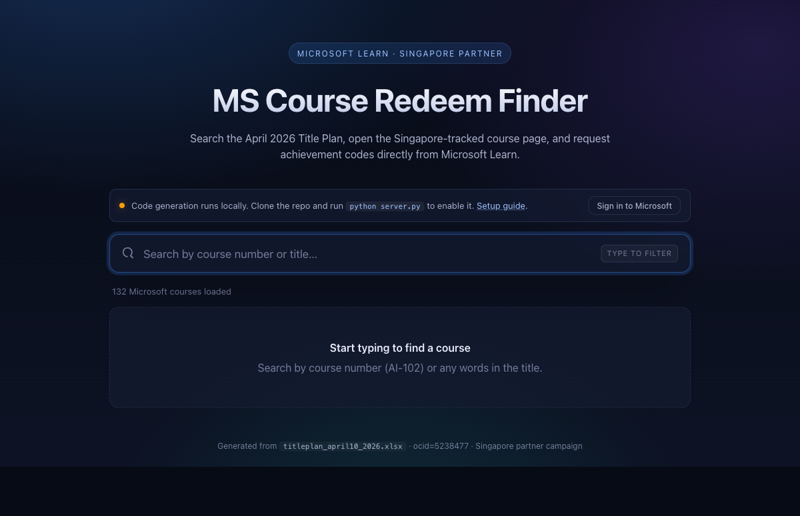

<div align="center">

# Microsoft Redeem Code Finder

[](https://python.org)
[](https://flask.palletsprojects.com)
[](https://playwright.dev)
[](https://alfredang.github.io/microsoftredeemcode/)

**A sleek web app for Singapore MCTs to search Microsoft Learn courses, open Singapore-tracked course pages, and generate achievement codes end-to-end via Playwright.**

[Live Demo](https://alfredang.github.io/microsoftredeemcode/) · [Report Bug](https://github.com/alfredang/microsoftredeemcode/issues) · [Request Feature](https://github.com/alfredang/microsoftredeemcode/issues)

</div>

## Screenshot



## About

A web app for Singapore-based Microsoft Certified Trainers (MCTs) to look up Microsoft Learn courses from the official Title Plan, open the correctly-tracked Singapore course page, and generate achievement codes end-to-end via Playwright browser automation.

> Code generation requires running the Python backend locally — GitHub Pages can only serve the static search UI.

### Key Features

- **Search** the 132-course April 2026 Title Plan by course number or title
- **Open Singapore course page** with correct partner tracking: `?WT.mc_id=ilt_partner_webpage_wwl&ocid=5238477`
- **Generate achievement codes** locally — Playwright drives Chromium through the full Microsoft Learn request flow
- **Auto-save** generated codes to CSV with timestamps for record-keeping
- **Debug support** — screenshots + HTML dumps on failure for easy troubleshooting

## Tech Stack

| Layer | Technology |
|-------|-----------|
| **Frontend** | Plain HTML / CSS / JS (no build step) |
| **Backend** | Flask (static serving + JSON API) |
| **Automation** | Playwright (Python) + Chromium |
| **Data Source** | Microsoft MCT Courseware Title Plan (Excel) |
| **Deployment** | GitHub Pages (static) / Local (full mode) |

## Architecture

```
┌─────────────────────────────────────────────────┐
│                  Browser (UI)                    │
│         index.html · styles.css · app.js         │
├─────────────────────────────────────────────────┤
│              Flask Server (server.py)             │
│         GET /  ──  Static file serving           │
│        POST /api/login  ──  Auth flow            │
│      POST /api/generate  ──  Code generation     │
├──────────────┬──────────────────┬────────────────┤
│  login.py    │   generate.py    │   paths.py     │
│  Headed      │   Headless       │   Shared       │
│  Chromium    │   Chromium       │   paths +      │
│  sign-in     │   code request   │   SG suffix    │
├──────────────┴──────────────────┴────────────────┤
│                  Data Layer                       │
│  courses.json · storage_state.json · codes.csv   │
└─────────────────────────────────────────────────┘
```

## Project Structure

```
microsoftredeemcode/
├── .github/workflows/pages.yml   # deploys webapp/ to GitHub Pages
├── titleplan_april24_2026.xlsx   # source of truth
├── webapp/
│   ├── index.html · styles.css · app.js   # static UI
│   ├── courses.json              # extracted from xlsx
│   ├── extract_courses.py        # xlsx → json
│   ├── server.py                 # Flask app: static + /api/*
│   └── backend/
│       ├── login.py              # Playwright sign-in flow
│       ├── generate.py           # Playwright code-generation flow
│       └── paths.py              # shared paths + Singapore URL suffix
└── README.md
```

## Getting Started

### Static Mode (search + SG links only)

Just open https://alfredang.github.io/microsoftredeemcode/ — no install required.

### Full Mode (with code generation)

```bash
git clone https://github.com/alfredang/microsoftredeemcode.git
cd microsoftredeemcode/webapp

# Install Python deps
python -m pip install flask playwright openpyxl
python -m playwright install chromium

# Start the app
python server.py
```

Open http://localhost:8000.

## Code Generation

### One-time: Sign in to Microsoft Learn

Click **Sign in to Microsoft** in the auth bar at the top of the page. A Chromium window opens — sign in with your MCT account, then either click the injected **Finish & save session** banner or close the window. Playwright writes your session to `webapp/data/storage_state.json` and reuses it silently for subsequent generations.

> ⚠️ `storage_state.json` contains live Microsoft auth cookies. It is in `.gitignore` — never commit it.

### Generating a Code

1. Search for a course.
2. On the matching card, set **Number of students**.
3. Click **Generate achievement code**.

The code + URL render inline on the card and are appended to `data/codes.csv`:

```csv
timestamp,courseNumber,code,url,students
2026-04-15T02:34:12+00:00,AI-102T00,8X582M,https://learn.microsoft.com/...,25
```

If a step fails, a screenshot + full page HTML dump land in `data/debug/` and the UI shows a step-labeled error.

## Updating the Title Plan

When a new `titleplan_*.xlsx` drops:

1. Replace the xlsx at the repo root.
2. Update the path in `webapp/extract_courses.py` if the filename changed.
3. Regenerate the JSON: `python webapp/extract_courses.py`.
4. Commit `courses.json` alongside the xlsx.

## Security Notes

- `storage_state.json` (MS auth cookies) and `codes.csv` (generated codes) are gitignored
- The Flask server binds to `127.0.0.1` only — not exposed to the network
- Never commit the `data/` folder contents

---

<div align="center">

**Developed by [Tertiary Infotech Academy Pte. Ltd.](https://tertiary.asia)**

Internal partner tooling. Not affiliated with or endorsed by Microsoft.

If this tool is helpful, give it a ⭐!

</div>
